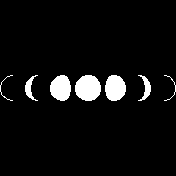

# banglejs-2-drawmoonphase #

draws the interior of two half ovals to symbolize a moon phase

This module adds a method `drawMoonPhase` for drawing an image symbolizing a moon phase to the global graphics context `g`. It is based on an idea of forum user [HilmarSt](http://forum.espruino.com/profiles/182487/) (see this [discussion](http://forum.espruino.com/conversations/371330/)).



The new method has the signature

```
g.drawMoonPhase(cx,cy, r, left, right);
```

with the following parameters:

* `cx` - x coordinate of the moon's center
* `cy` - y coordinate of the moon's center
* `r` - moon radius
* `left` - left factor (see below)
* `right` - right factor (see below)

The moon phase is drawn and filled with current foreground color.

### Semantics of "left" and "right" ###

`left` and `right` specify the actual phase that is to be shown:

* both values range from -1...+1
* set both to `1` for a full moon
* set `right = 1` and start with `left = -1` for a waxing moon. Increase `left` until `1` for a full moon
* set `left = 1` and start with `right = 1` for a waning moon. Decrease `right` until `-1`

## Example ##

The following example illustrates how to use `drawMoonPhase` and produces the graphics shown above:

```
  g.setBgColor('#000000');
  g.clear(false);

  require('https://raw.githubusercontent.com/rozek/banglejs-2-drawmoonphase/main/drawMoonPhase.js');

  let ScreenWidth  = g.getWidth(),  CenterX = ScreenWidth/2;
  let ScreenHeight = g.getHeight(), CenterY = ScreenHeight/2;

  let Diameter = Math.floor(ScreenWidth / 7);
  let Radius   = Diameter/2;

  g.clear();

  g.setColor('#FFFFFF');

  g.drawMoonPhase(CenterX-3*Diameter,CenterY, Radius, 1,-1);
  g.drawMoonPhase(CenterX-2*Diameter,CenterY, Radius, 1,-0.6);
  g.drawMoonPhase(CenterX-1*Diameter,CenterY, Radius, 1,0.6);
  g.drawMoonPhase(CenterX-0*Diameter,CenterY, Radius, 1,1);
  g.drawMoonPhase(CenterX+1*Diameter,CenterY, Radius, 0.6,1);
  g.drawMoonPhase(CenterX+2*Diameter,CenterY, Radius, -0.6,1);
  g.drawMoonPhase(CenterX+3*Diameter,CenterY, Radius, -1,1);
```

## License ##

[MIT License](LICENSE.md)
